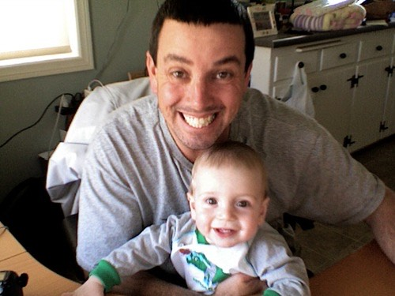
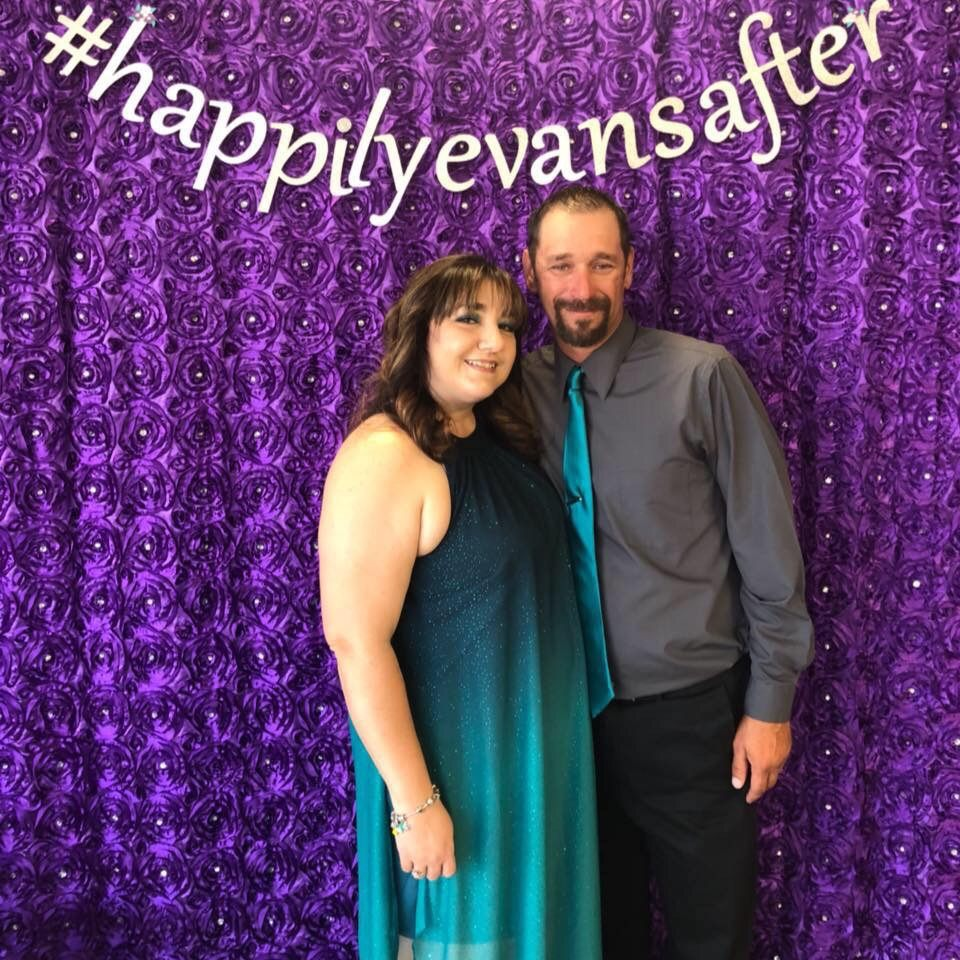
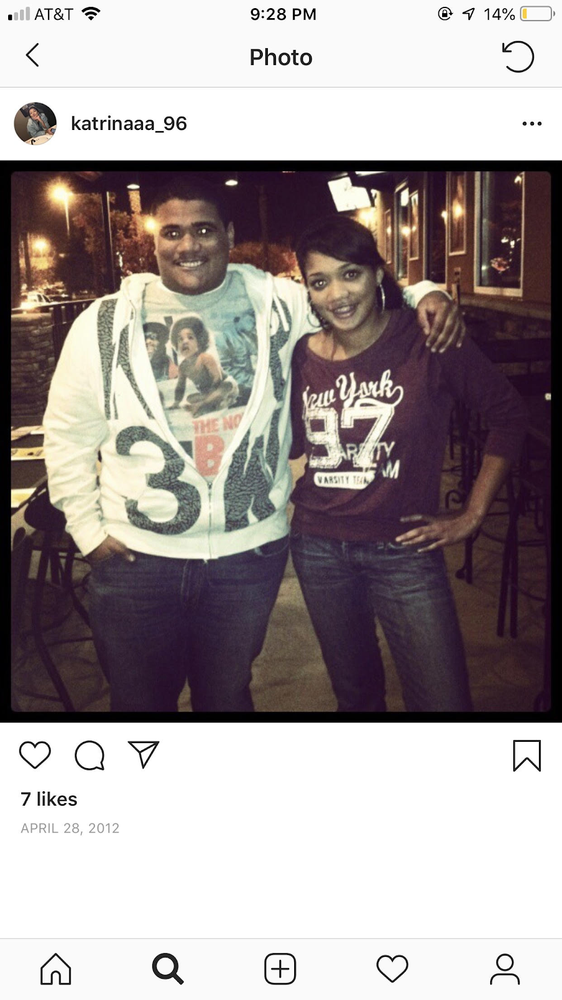
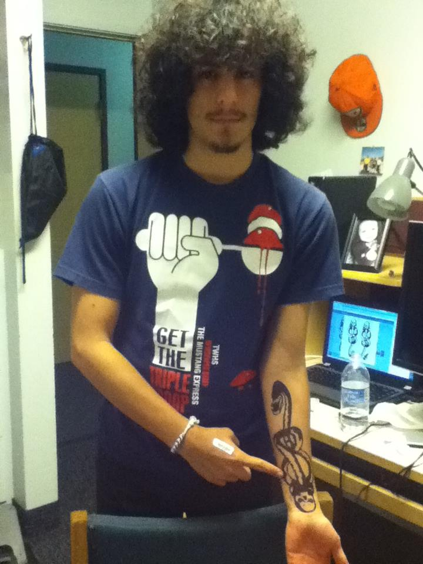
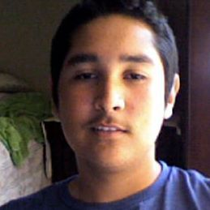
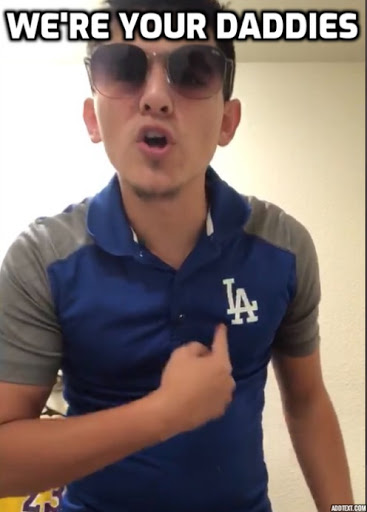
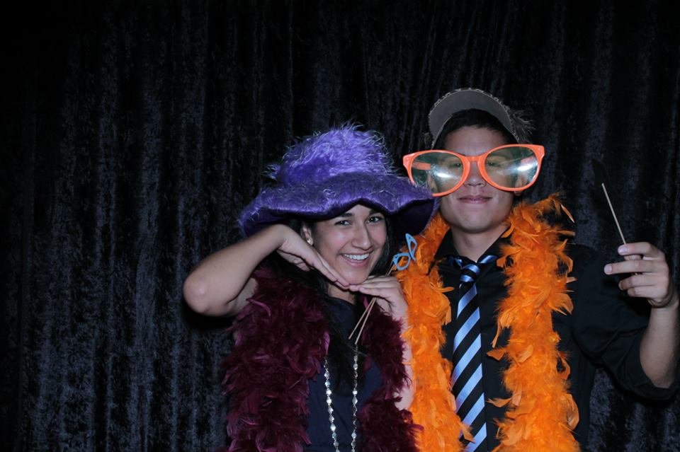
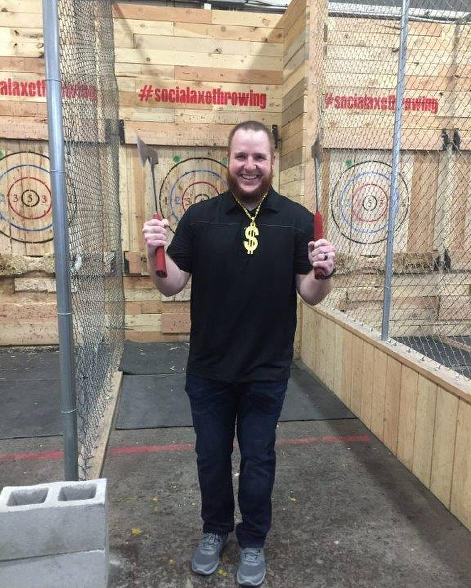
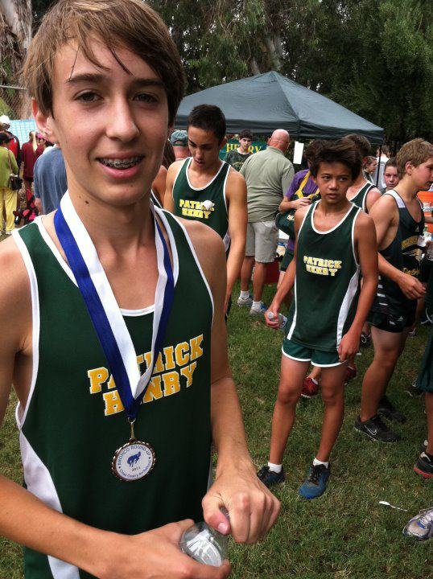

```{r setup, include=FALSE}
knitr::opts_chunk$set(echo = TRUE)
```

# About Us

```{r message=FALSE, warning=FALSE, include=FALSE, paged.print=FALSE}
source("utils.R")

# Casey Walter
# Cesar Vieira
# Damien Thomas
# Dan Fillat
# Dominic Krohn
# Edwin Castro
# Jordan Proctor
# Jose Zavalza
# Marc Krohn
# Michael Gonzalez
# Randall Madsen
# Tate Graham
```


## Casey Walter

```{r kc, echo=FALSE, fig.cap="Casey", out.width = '40%'}

```


## Dan Fillat

```{r lm, echo=FALSE, fig.cap="Dan", out.width = '40%'}

```


## Cesar Vieira

```{r CV, echo=FALSE, fig.cap="Cesar", out.width = '40%'}

```


## Damien Thomas

```{r D$ , echo=FALSE, fig.cap="Damien", out.width = '40%'}

```


## Dominic Krohn

```{r DOM, echo=FALSE, fig.cap="Dominic", out.width = '40%'}

```


## Edwin Castro

```{r EDWN, echo=FALSE, fig.cap="Edwin", out.width = '40%'}

```


## Jordan Proctor

```{r JP, echo=FALSE, fig.cap="Jordan", out.width = '40%'}
knitr::include_graphics("JP.png")
```


## Jose Zavala

```{r JOE, echo=FALSE, fig.cap="Jose", out.width = '40%'}

```


## Marc Krohn

```{r MELO, echo=FALSE, fig.cap="Marc", out.width = '40%'}

```


## Michael Gonzalez

```{r Mike, echo=FALSE, fig.cap="Michael", out.width = '40%'}

```


## Randall Madsen

```{r Randall, echo=FALSE, fig.cap="Randall", out.width = '40%'}

```


## Tate Graham

```{r Tate, echo=FALSE, fig.cap="Tate", out.width = '40%'}

```